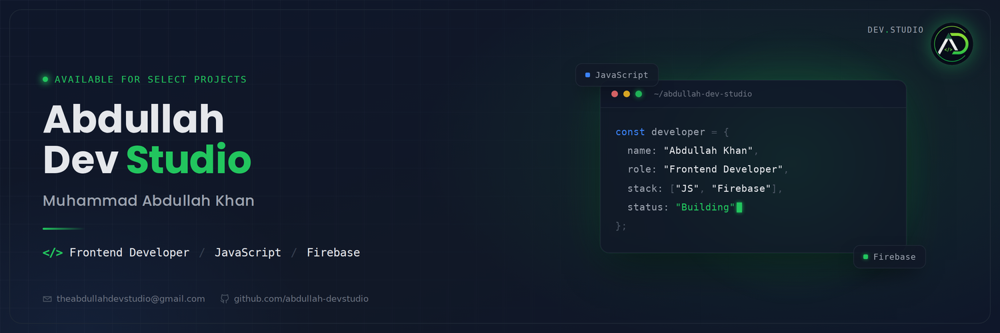
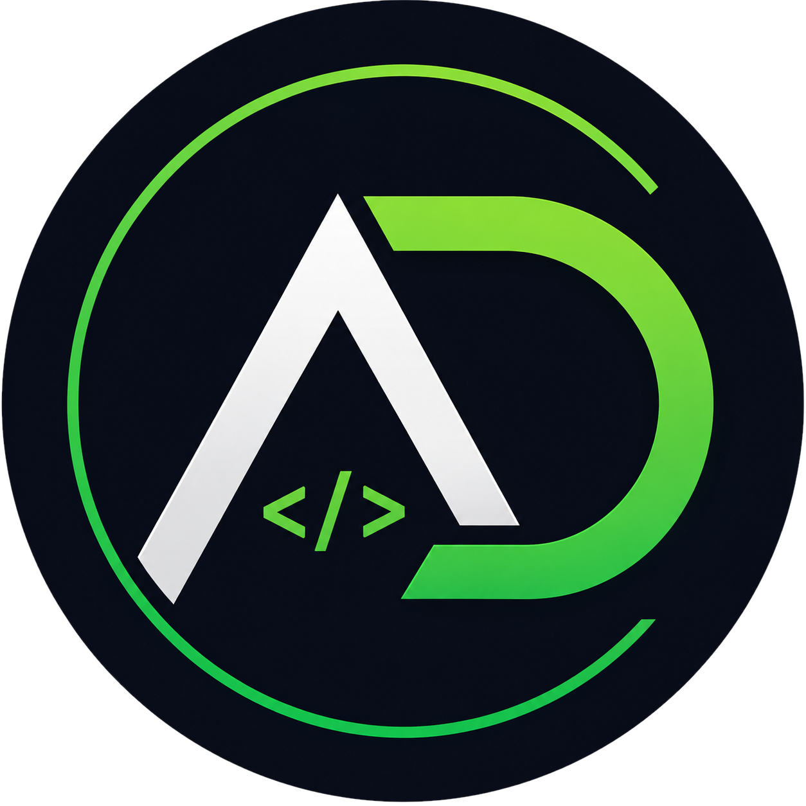

<div align="center">



<br/>



# Muhammad Abdullah Khan

<a href="https://readme-typing-svg.demolab.com">
  
</a>

<br/>

<a href="https://www.linkedin.com/in/abdullahdevstudio">
  
</a>
<a href="https://github.com/abdullah-devstudio">
  
</a>
<a href="mailto:theabdullahdevstudio@gmail.com">
  
</a>

</div>

<br/>

##  About Me

I'm a Frontend Developer focused on building clean, responsive, and reliable web interfaces. I work primarily with **HTML, CSS, and JavaScript**, and use **Firebase** for authentication, real-time data, and hosting. My focus is on writing maintainable code and delivering products that hold up in production, not just in a demo.

```js
const developer = {
  name: "Muhammad Abdullah Khan",
  role: "Frontend Developer",
  stack: ["HTML", "CSS", "JavaScript", "Firebase"],
  focus: "Clean UI, reliable code, real-world products",
  currentlyBuilding: "CareerPilot AI"
};
```

<br/>

##  Skills

<div align="left">
  
</div>

<br/>

<table>
  <tr>
    <th align="left">Category</th>
    <th align="left">Skills</th>
  </tr>
  <tr>
    <td>Markup &amp; Styling</td>
    <td>HTML5, CSS3 (Flexbox, Grid, responsive design)</td>
  </tr>
  <tr>
    <td>Programming</td>
    <td>JavaScript (ES6+, DOM manipulation, async/await)</td>
  </tr>
  <tr>
    <td>Backend &amp; Services</td>
    <td>Firebase (Auth, Firestore, Realtime Database, Hosting)</td>
  </tr>
  <tr>
    <td>Tools</td>
    <td>Git, GitHub, VS Code, Chrome DevTools</td>
  </tr>
</table>

<br/>

##  Featured Project

<table>
  <tr>
    <td width="100%">
      <h3>CareerPilot AI</h3>
      <p>
        An AI-powered career guidance platform that helps users explore career paths,
        get personalized recommendations, and plan their next steps. Built with a
        responsive frontend and Firebase for authentication and data.
      </p>
      <p>
        
        
        
        
      </p>
      <a href="https://github.com/abdullah-devstudio">
        
      </a>
    </td>
  </tr>
</table>

<br/>

##  GitHub Stats

<div align="center">
  
  
</div>

<br/>

## Contact

<div align="center">

<table>
  <tr>
    <td align="center">
      <a href="mailto:theabdullahdevstudio@gmail.com">
        
      </a>
    </td>
  </tr>
  <tr>
    <td align="center">
      <a href="https://www.linkedin.com/in/abdullahdevstudio">
        
      </a>
    </td>
  </tr>
  <tr>
    <td align="center">
      <a href="https://github.com/abdullah-devstudio">
        
      </a>
    </td>
  </tr>
</table>

<sub>© Abdullah Dev Studio · Muhammad Abdullah Khan</sub>

</div>
